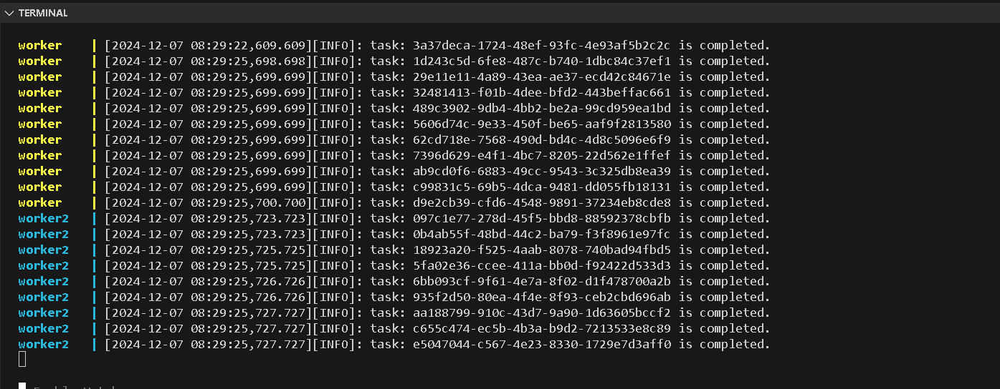
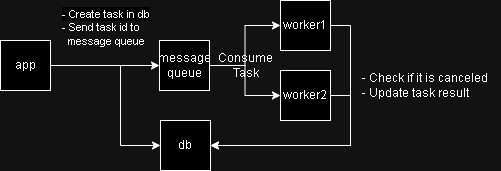

# Assignment - High-Throughput Task Processing System



## Any assumptions or additional design decisions
1. Each task has `payload` as input, and generate `result` or `error`, which separately stored in columns.
2. To *simplify* the task, it only *sleep 3 seconds* and calculate the *payload length* as its result. So it is a *io-intensive task*.
3. Because tasks are *io-intensive*, it is better to be running multiple tasks in bulk.
4. Assume worker check task cancellation only at the begin and the end of work. There is no need to interrupt the task in real-time.
5. system architecture is below:
    - Use postgres as persisted storage and rabbitmq as message queue.
    - Throughout can scale up with adding more workers.
    - Worker consumes tasks in chunk with the help of rabbitmq prefetch.
    - Application only send task id to message queue and let worker check its status on persisted storage.
    - Two phase commit between message queue and persisted storage, considering application server down.
    
6. unit test on both [use_case](./tests/unit/test_tasks_use_case.py) and [endpoint](./tests/unit/test_tasks_endpoint.py).

## Project architecture

```
├── app
│   ├── api
│   ├── config
│   ├── domain
│   ├── repositories
│   ├── use_cases
│   ├── main.py
│   └── worker.py
├── deploy
│   ├── .env.app
│   ├── .env.postgres
│   ├── .env.rabbitmq
│   ├── docker-compose.yaml
│   ├── Dockerfile.app
│   └── Dockerfile.worker
├── tests
│   └── unit
├── poetry.lock
├── pyproject.toml
├── Assignment.md
└── README.md
```
Follow part of clean architecture but left domain object the same as ORM object. Separation of use_case, repository, and request handler  apart to implement unit testing more easily.


## How to run the application using Docker or Docker Compose
1. Fill `./deploy/.env.app`, `./deploy/.env.postgres` and `./deploy/.env.rabbimq`

2. Check potential resources conflicts of `./deploy/docker-compose.yaml`, e.g., port `5432`, `5672` and `8000` is not occupied by other process.

3. Run docker compose file
```bash
cd deploy
docker-compose up
```

4. test it with fastapi swagger (http://127.0.0.1:8000/docs)


## How to execute tests
1. Install dependencies
```bash
poetry install
poetry shell
```

2. Run commands
```bash
pytest tests/
```


## TODO
- [ ] Refactor logging
- [ ] Reduce io with single query without ORM
- [ ] Add Benchmark
- [ ] Implement Opentelemetry
